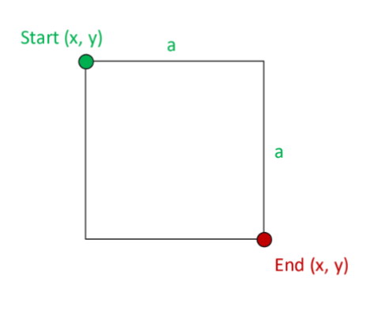

# golang-united-school-homework-5.1

For the given structure of a Square, create the methods to return end point, area and perimeter using given signatures.

NOTE: receiver is a placeholder, replace appropriately
